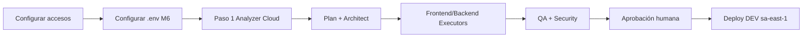

# Runbook — Primera ejecución novus-intelligence (Lovable → DEV)

**Proyecto:** `novus-intelligence`  
**Design source:** [novus-nexus](https://github.com/arodriguez-novusintelligence/novus-nexus.git)  
**Motor de ejecución:** Cursor Cloud Agent (ADR-0005)  
**Entorno objetivo:** AWS DEV · **sa-east-1**  
**Workflow:** `lovable-to-web` (18 pasos)

---

## Visión rápida



**Importante:** la primera vez **no** empieces desplegando. Primero Intent/análisis → Plan → código → validación → **solo entonces** deploy DEV con tu OK.

---

## FASE A — Configuración (hazlo una vez)

### A1. Repositorios GitHub

Asegura que existen y que tu cuenta **arodriguez-novusintelligence** tiene acceso:

| Rol | Repo |
|-----|------|
| Framework | `NovusAIDevelopmentFramework` |
| Lovable | `novus-nexus` ← ya indicado |
| Frontend | `NovusIntelligenceWEB` |
| Backend | `NovusIntelligenceBack` |

Si WEB/Back aún no existen, créalos vacíos (o con scaffold mínimo) **antes** de los Executors. El Analyzer (paso 1) solo necesita Framework + novus-nexus.

### A2. Conectar GitHub a Cursor Cloud Agents

1. Entra a [cursor.com/agents](https://cursor.com/agents) (o Dashboard Cloud Agents).
2. Conecta la organización/cuenta GitHub `arodriguez-novusintelligence`.
3. Autoriza los 4 repos anteriores (mínimo Framework + novus-nexus para el día 1).
4. Verifica en el dashboard que aparecen en “Repositories”.

Esto es la **sincronización**: Cloud Agent no “se une” a NADF; Cloud Agent **clona** los repos que le pases al lanzar. NADF vive en el repo Framework.

### A3. API Key de Cloud Agent

1. [Cursor Dashboard → Integrations](https://cursor.com/dashboard/integrations)
2. Crea / copia `CURSOR_API_KEY`
3. **No** la commits. Solo en `.env` local o secret store.

### A4. AWS DEV (sa-east-1) — preparación (sin deploy aún)

1. Cuenta AWS con permiso en región **sa-east-1**.
2. Perfil CLI o rol OIDC listo para más adelante (deploy).
3. Revisa template: `.nadf/projects/novus-intelligence/environments/dev.yml` (ya apunta a `sa-east-1`).
4. **No** desplieges stacks hasta pasar QA + tu aprobación.

### A5. Configurar el prototipo M6

```powershell
cd c:\NovusIntelligence\FrameworkMultiagenticoIA\Workspace\NovusAIDevelopmentFramework\prototypes\m6-cloud-agent
cp .env.example .env
```

Edita `.env`:

```env
CURSOR_API_KEY=cursor_...tu_key...
NADF_MODEL=composer-2.5
NADF_PROJECT_ID=novus-intelligence
NADF_REPO_FRAMEWORK=https://github.com/arodriguez-novusintelligence/NovusAIDevelopmentFramework.git
NADF_REPO_LOVABLE=https://github.com/arodriguez-novusintelligence/novus-nexus.git
NADF_REF_FRAMEWORK=feature/nadf-foundation
NADF_REF_LOVABLE=
NADF_AUTO_CREATE_PR=false
```

```powershell
npm install
```

### A6. Contexto NADF del proyecto (ya existe)

Verifica:

- `.nadf/projects/novus-intelligence/project-context.yml` → región `sa-east-1`, URLs de repos, `execution_engine: cursor-cloud`
- `environments/dev.yml` → `sa-east-1`
- Workflow: `.nadf/projects/novus-intelligence/workflows/lovable-to-web.yml`

Si cambias región o repos, actualiza esos YAML **antes** de lanzar agentes.

---

## FASE B — Primera ejecución (día 1): solo análisis

Objetivo: que Cloud Agent actúe como **`lovable-analyzer-agent`**, lea Lovable (`novus-nexus`) y deje artifacts en el Blackboard. **Sin código productivo. Sin deploy.**

```powershell
cd prototypes\m6-cloud-agent
npm run invoke:lovable-analyzer
```

### Qué debe pasar

1. Se crea un Cloud Agent (`bc-...`) en el dashboard.
2. Clona Framework + novus-nexus.
3. Lee `CLAUDE.md`, Meta Model, `project-context.yml`, `.claude/agents/lovable-analyzer-agent.md`.
4. Genera (idealmente en branch/artifacts):

   - `cambios-lovable.json`
   - `frontend-impact.md`
   - `backend-impact.md`
   - `riesgos.md`

5. Tú revisas el run y los artifacts.

### Si falla

| Síntoma | Qué revisar |
|---------|-------------|
| 401 | `CURSOR_API_KEY` |
| Repo denied | GitHub no conectado a Cloud / permisos |
| Local en vez de cloud | El adaptador debe pasar `cloud:` (ya lo hace el prototipo) |
| Sin novus-nexus | URL `NADF_REPO_LOVABLE` |

---

## FASE C — Segunda oleada: Planning (Cloud Agent, sin código)

Para cada rol, lanza un Cloud Agent (UI o extendiendo el prototipo) con la [plantilla de prompt](../cloud-agent-integration.md#31-plantilla-de-prompt-reutilizable):

| Orden | Agente NADF | Repos a clonar |
|-------|-------------|----------------|
| 2 | `planner-agent` | Framework (+ artifacts del analyzer) |
| 3–5 | `backend-impact-agent`, `architect-agent`, `workflow-agent` | Framework |
| 6 | Plan Review (`architect-agent`) | Framework |

**Gate:** no pases a Execution hasta tener `plan-implementacion.md` con status approved (humano o reviewer).

---

## FASE D — Execution (código) con Cloud Agent

| Orden | Agente NADF | Repos |
|-------|-------------|-------|
| 7 | `frontend-integration-agent` | Framework + NovusIntelligenceWEB (+ nexus solo lectura) |
| 8–10 | `backend-agent` / `database-agent` / `cloud-agent` (IaC) | Framework + Back |

Reglas:

- Branches `feature/*`
- Preferible `autoCreatePR: true`
- **No** merge a main/prod sin revisión en Cursor IDE
- **No** deploy automático

El rol NADF `cloud-agent` propone IaC / Serverless para **sa-east-1 DEV** según `environments/dev.yml`. Tú apruebas.

---

## FASE E — Validation + Knowledge

QA → Security → Reviewer → Docs → Metrics → Reflection → KB → ADR (si aplica).

---

## FASE F — Deploy DEV (sa-east-1) — solo con tu OK

Cuando el código esté en PR mergeado y gates en verde:

1. Revisar propuesta del `cloud-agent` / DevOps (stack names de `dev.yml`).
2. Ejecutar deploy **manual o asistido** a **sa-east-1** (CLI/CI con aprobación).
3. Validar URL DEV y API DEV.
4. Registrar métricas + reflexión.

NADF **prohíbe** deploy autónomo a producción; DEV también requiere aprobación explícita en este runbook.

---

## Checklist “¿ya sincronizamos Cloud Agent?”

- [ ] GitHub org conectada en Cursor Cloud
- [ ] Repos Framework + novus-nexus autorizados
- [ ] `CURSOR_API_KEY` en `.env` del prototipo
- [ ] `project-context.yml` con URLs y `sa-east-1`
- [ ] `dev.yml` en `sa-east-1`
- [ ] Primera corrida `invoke:lovable-analyzer` exitosa (o bloqueada con razón clara en `riesgos.md`)

Cuando esos checks estén en verde, Cloud Agent está acoplado al proyecto NADF. El resto es ejecutar roles del workflow uno a uno.

---

## Referencias

- [cloud-agent-integration.md](../cloud-agent-integration.md)
- [agent-runtime-contract.md](../runtime/agent-runtime-contract.md)
- [ADR-0005](../../.nadf/global/decision-history/adr/ADR-0005-agent-runtime-bridge.md)
- [project-context.yml](../../.nadf/projects/novus-intelligence/project-context.yml)
- [environments/dev.yml](../../.nadf/projects/novus-intelligence/environments/dev.yml)
