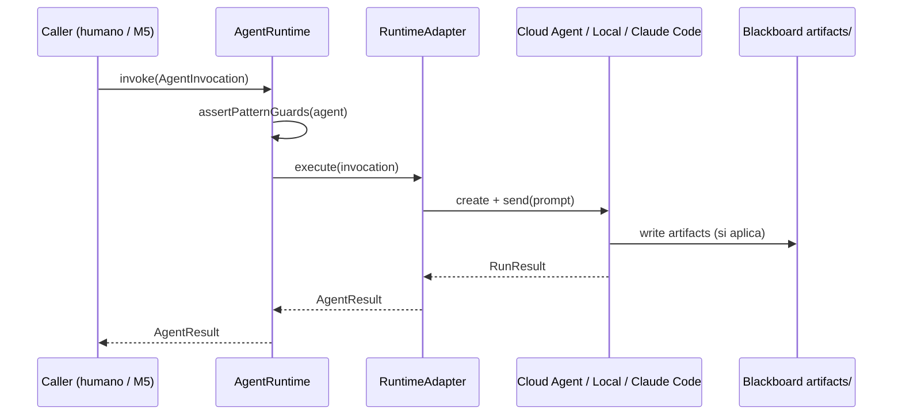

<!-- NADF-GUIDE
Propósito: Documenta AgentRuntime Contract — NADF M6.
Configuración: Actualizar contenido, enlaces y ejemplos cuando cambien los contratos relacionados.
-->
# AgentRuntime Contract — NADF M6

**Versión:** 0.1.0 (diseño + prototipo)  
**Estado:** Normativo para adaptadores M6  
**ADR:** [ADR-0005](../../.nadf/global/decision-history/adr/ADR-0005-agent-runtime-bridge.md)  
**Independencia de proveedor:** el contrato no menciona APIs propietarias; los adaptadores sí.

---

## 1. Propósito

Definir la interfaz mínima mediante la cual el framework (o un humano, o M5) **invoca un Agent NADF** sobre un motor externo, sin filtrar las reglas del Meta Model.



---

## 2. Tipos conceptuales

### 2.1 `AgentInvocation`

| Campo | Tipo conceptual | Descripción |
|-------|-----------------|-------------|
| `agentId` | string | Id canónico (ej. `lovable-analyzer-agent`) |
| `projectId` | string | Id bajo `.nadf/projects/` |
| `workflowId` | string | Id de workflow (ej. `novus-intelligence-lovable-to-web`) |
| `stepId` | string | Paso YAML (ej. `paso-01-analizar-lovable`) |
| `pattern` | enum | `planner` \| `executor` \| `validator` \| `event_driven` \| `blackboard` \| `reflection` \| `mediator` |
| `repos` | RepoRef[] | Repos a clonar/usar |
| `inputs` | string[] | Rutas de contexto / artifacts de entrada |
| `expectedOutputs` | string[] | Artifacts obligatorios |
| `constraints` | string[] | Prohibiciones adicionales |
| `autoCreatePR` | boolean | Solo Executor/Validator con cambios de código |
| `dryRun` | boolean | Si true, no escribe código productivo |

### 2.2 `RepoRef`

| Campo | Descripción |
|-------|-------------|
| `role` | `framework` \| `lovable_source` \| `frontend` \| `backend` \| `other` |
| `url` | URL HTTPS del repo |
| `ref` | Branch / tag / commit (opcional) |

### 2.3 `AgentResult`

| Campo | Descripción |
|-------|-------------|
| `status` | `finished` \| `error` \| `cancelled` \| `blocked` |
| `runtime` | `cursor-cloud` \| `cursor-local` \| `claude-code` \| `other` |
| `agentRuntimeId` | Id del motor (ej. `bc-...`) |
| `runId` | Id de la corrida |
| `filesChanged` | Lista de rutas |
| `artifactsProduced` | Lista de artifacts esperados presentes |
| `summary` | Texto corto |
| `blockers` | Motivos de bloqueo NADF |
| `metrics` | Subconjunto de `metrics-schema.json` |

---

## 3. Interfaz `AgentRuntime`

```ts
interface AgentRuntime {
  /** Invoca exactamente un rol NADF. */
  invoke(invocation: AgentInvocation): Promise<AgentResult>;

  /** Reanuda un agente durable del motor (si el adaptador lo soporta). */
  resume?(runtimeAgentId: string, followUpPrompt: string): Promise<AgentResult>;
}
```

### Interface `RuntimeAdapter`

```ts
interface RuntimeAdapter {
  readonly name: string; // ej. "cursor-cloud" | "anthropic" | "noop"
  supports(capability: "invoke" | "resume" | "stream" | "pr"): boolean;
  execute(invocation: AgentInvocation, prompt: string): Promise<AgentResult>;
}
```

### Factory (provider-agnostic)

Los callers **no** deben instanciar `CursorCloudAdapter` directamente. Usar:

```ts
import { createAdapter } from "./ai-runtime/index.js";
const runtime = new NadfAgentRuntime(createAdapter());
```

Selección: `NADF_CODING_RUNTIME` (`cursor-cloud` default | `anthropic` | `noop`).  
Catálogo: `.nadf/global/ai-runtime/providers.yml` · ADR: ADR-0008.

Si `autoCreatePR` / executor y el adapter no `supports("pr")` → `blocked`.

---

## 4. Guardas por patrón (obligatorias)

| Patrón | Puede modificar código productivo | Puede crear PR | Puede desplegar |
|--------|-----------------------------------|----------------|-----------------|
| Planner / Event Driven (analyzer) | No | No* | No |
| Executor | Sí, tras plan aprobado | Sí | No |
| Validator | Solo fixes autorizados | Sí (fixes) | No |
| Blackboard / Reflection | Solo docs/KB/artifacts | Opcional | No |

\*Excepto commits de **solo artifacts** en el repo framework, si el flujo lo contempla.

Si se viola una guarda, `status: blocked` **antes** de llamar al motor.

---

## 5. Construcción del prompt

Todo adaptador DEBE ensamblar el prompt así:

1. Identidad: `agentId`
2. Lectura obligatoria: `CLAUDE.md` → Meta Model overview → `project-context.yml` → `.claude/agents/<id>.md`
3. Contexto: `projectId`, `workflowId`, `stepId`, `inputs`, `expectedOutputs`
4. Constraints del patrón + del agente
5. Formato de respuesta final estructurado (status, filesChanged, blockers)

Ver plantilla en `docs/cloud-agent-integration.md` §3.1.

---

## 6. Adaptador Cursor Cloud (v0.1)

| Propiedad | Valor |
|-----------|-------|
| SDK | `@cursor/sdk` |
| Runtime option | `cloud: { repos: [...] }` — **siempre explícito** |
| Auth | `CURSOR_API_KEY` |
| Model | configurable (`composer-2.5` o `auto`) |
| Observabilidad | log inmediato de `agentId` + `runId` |
| Dispose | `await using` / try-finally |

Errores:

| Condición | Mapeo AgentResult / exit |
|-----------|---------------------------|
| `CursorAgentError` (auth/config) | no start → exit 1 |
| `result.status === "error"` | run falló → exit 2 |
| Guarda NADF | `blocked` → exit 3 |

---

## 7. Adaptadores previstos

| Adaptador | Prioridad | Notas |
|-----------|-----------|-------|
| `cursor-cloud` | P0 (este ADR) | Prototipo paso 1 |
| `cursor-local` | P1 | `local: { cwd }` |
| `claude-code` | P2 | CLI / cloud agent Anthropic |
| `noop-dry-run` | P1 | Solo valida prompt y guardas |

---

## 8. Relación con M5

M5 (Workflow Engine) consumirá:

```text
for step in workflow.steps:
  result = runtime.invoke(stepToInvocation(step))
  if result.status != finished: halt / escalate
```

Este contrato garantiza que M5 **no** importe APIs de Cursor.

---

## 9. Criterios de aceptación del diseño M6 v0.1

- [x] Contrato documentado
- [x] ADR-0005 Accepted
- [x] Prototipo invoca `lovable-analyzer-agent` en Cloud
- [ ] Segundo adaptador (local o noop)
- [ ] Invocación desde M5
- [ ] Enforcement automático de guardas en todos los agents

---

## 10. Referencias

- Prototipo: `prototypes/m6-cloud-agent/`
- Guía: `docs/cloud-agent-integration.md`
- Skill registry: `.nadf/global/skill-registry/`
- Metrics: `.nadf/global/metrics/metrics-schema.json`
