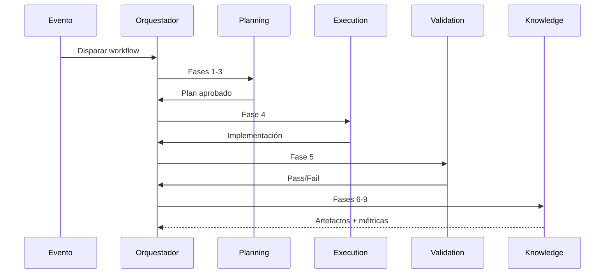

# Modelo de workflows NADF

## Concepto

Un **workflow NADF** es una secuencia ordenada de pasos que coordina agentes especializados siguiendo el **modelo multiagente de 9 fases**. Los workflows se definen en YAML, son versionados, reutilizables y pueden dispararse por eventos.

Ver [event-driven-workflows.md](event-driven-workflows.md) y [orchestrator-pattern.md](orchestrator-pattern.md).

## Modelo de 9 fases (obligatorio)

Todo workflow de implementación debe incluir estas fases:

| # | Fase | Agentes típicos |
|---|------|-----------------|
| 1 | Event Trigger | Workflow Agent |
| 2 | Planning | Lovable Analyzer, Planner, Backend Impact |
| 3 | Plan Review | Architect Agent |
| 4 | Execution | Frontend, Backend, Database, Cloud, DevOps |
| 5 | Validation | QA, Security, Reviewer |
| 6 | Documentation | Documentation Agent |
| 7 | Metrics | Metrics Agent |
| 8 | Reflection | Reflection Agent |
| 9 | Knowledge Base Update | Knowledge Base Agent, ADR Agent |

## Ubicaciones

| Tipo | Ruta | Alcance |
|------|------|---------|
| Global | `.nadf/global/workflow-library/` | Reutilizable en cualquier proyecto |
| Proyecto | `.nadf/projects/<proyecto>/workflows/` | Específico del proyecto |

## Anatomía de un workflow YAML

```yaml
id: identificador-unico
name: Nombre descriptivo
version: "2.0.0"
description: Qué hace este workflow
project: nombre-proyecto | "*"
triggers:
  - manual
  - command:nombre-comando
  - event:tipo.evento

model:
  phases:
    - event_trigger
    - planning
    - plan_review
    - execution
    - validation
    - documentation
    - metrics
    - reflection
    - knowledge_base_update

agents:
  - agent-id

steps:
  - id: paso-id
    phase: planning
    agent: agent-id
    action: descripcion
    conditions: [...]
    inputs: [...]
    outputs: [...]

quality_gates:
  - gate-id

metrics:
  enabled: true
  schema: metrics-schema.json
```

## Workflows globales disponibles

| ID | Archivo | Descripción |
|----|---------|-------------|
| lovable-to-web | `lovable-to-web.yml` | Sincronizar Lovable al stack productivo |
| create-project | `create-project.yml` | Incorporar proyecto a NADF |
| modify-feature | `modify-feature.yml` | Modificar funcionalidad |
| fix-bug | `fix-bug.yml` | Corregir bug |
| cloud-deployment | `cloud-deployment.yml` | Preparar despliegue cloud |
| security-review | `security-review.yml` | Revisión de seguridad |
| qa-validation | `qa-validation.yml` | Validación QA independiente |
| reflection-learning | `reflection-learning.yml` | Reflexión y KB post-workflow |
| requirement-intake | `requirement-intake.yml` | Ingesta multi-fuente → Requirement → Intent (ADR-0007, opt-in) |

## Herencia con `extends:`

Los workflows de proyecto pueden declarar `extends: <id-workflow-global>` para indicar que **heredan** del workflow canónico en `.nadf/global/workflow-library/`.

### Significado de `extends`

| Concepto | Definición |
|----------|------------|
| Workflow canónico | Archivo en `.nadf/global/workflow-library/`; define el **orden de fases** y la secuencia de agentes |
| Workflow de proyecto | Archivo en `.nadf/projects/<proyecto>/workflows/`; **extiende** el global añadiendo contexto local |
| Orden de fases | **Inmutable** en proyectos; no se puede invertir Planning/Execution ni mover agentes entre fases |

### Reglas de merge

| Campo | Comportamiento |
|-------|----------------|
| `model.phases` | Heredado del global; el proyecto **no puede** reordenar ni omitir fases |
| `steps` | El proyecto puede **enriquecer** pasos (inputs, outputs, reglas, condiciones) pero debe **preservar** `phase` y orden relativo del canónico |
| `agents` | Unión: agentes del global + agentes adicionales del proyecto; no se eliminan agentes requeridos por fase |
| `quality_gates` | Heredados del global; el proyecto puede **añadir** gates, no eliminar los obligatorios |
| `triggers` | El proyecto puede añadir triggers específicos; los del global permanecen válidos |
| `mapping` | **Exclusivo del proyecto**; mapeo de rutas, componentes o entidades locales |
| `event` | **Exclusivo del proyecto**; metadatos del evento disparador |

### Restricciones

1. El workflow global es la **fuente de verdad** para el orden de fases.
2. Un proyecto **no debe** colocar agentes de Execution antes de completar Planning y Plan Review.
3. `backend-impact-agent` debe ejecutarse en **Planning**, antes de `architect-agent` (Plan Review) y antes de cualquier paso de **Execution**.
4. `frontend-integration-agent` solo ejecuta en **Execution**, condicionado a `plan-implementacion.md:status == approved`.
5. Si un workflow de proyecto redefine todos los pasos, debe documentar explícitamente qué añade respecto al canónico (ver comentarios en el YAML del proyecto).

## Workflow de proyecto: novus-intelligence

`lovable-to-web.yml` — **18 pasos** alineados al canónico global, ante evento `lovable.commit` en novus-nexus:

1. Workflow Agent (Event Trigger) → 2. Cargar contexto → 3. Lovable Analyzer → 4. Planner → 5. Backend Impact → 6. Architect (Plan Review) → 7. Frontend (cond.) → 8. Backend (cond.) → 9. Database (cond.) → 10. Cloud (cond.) → 11. QA → 12. Security → 13. Reviewer → 14. Documentation → 15. Metrics → 16. Reflection → 17. KB → 18. ADR

Extiende: `.nadf/global/workflow-library/lovable-to-web.yml` (canónico, ADR-0003).

## Flujo de ejecución



## Quality gates en workflows

Gates estándar:

- `plan_approved` — Plan aprobado por Architect Agent
- `no_lovable_code_copy` — Sin copia Lovable
- `no_mock_data_in_production` — Sin mocks en prod
- `build_success` — Build exitoso
- `responsive_validation` — Responsive OK
- `seo_basic_validation` — SEO básico OK
- `security_pass` — Security Agent pass

Un gate crítico fallido **bloquea** el workflow.

## Condiciones y ramificaciones

```yaml
- id: implementar-backend
  agent: backend-agent
  conditions:
    - evaluacion-backend.md:requires_backend == true
    - plan-implementacion.md:status == approved
```

## Comandos asociados

| Comando | Workflow |
|---------|----------|
| `novus-lovable-sync` | novus-intelligence/lovable-to-web (18 pasos) |
| `setup-project-context` | create-project |

## Métricas

Cada ejecución registra métricas según `metrics-schema.json`, incluyendo campos de reflexión: `reflectionSummary`, `patternsIdentified`, `failuresDocumented`, `kbUpdatesRecommended`.

## Principios

1. **Workflows declarativos** — Orquestación en YAML, no código productivo.
2. **Separación de fases** — Planning ≠ Execution ≠ Validation.
3. **Trazabilidad** — Cada paso genera artefactos en Blackboard.
4. **Event-driven** — Triggers por eventos del ecosistema.
5. **Extensibilidad** — Nuevos workflows sin modificar existentes.

## Referencias

- Workflow library: `.nadf/global/workflow-library/`
- Proyecto novus-intelligence: `.nadf/projects/novus-intelligence/workflows/`
- [Planificación, ejecución y validación](planning-execution-validation.md)
